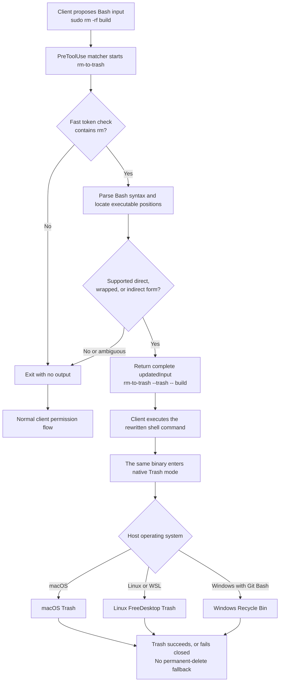

# rm-to-trash

[](https://github.com/ShlomoStept/rm-to-trash-hook/actions/workflows/ci.yml)
[](https://github.com/ShlomoStept/rm-to-trash-hook/releases/latest)
[](LICENSE)

`rm-to-trash` is a cross-platform `PreToolUse` hook for Claude Code and Codex.
It recognizes supported `rm` commands before they execute and replaces permanent
deletion with the native recovery mechanism:

- Trash on macOS
- FreeDesktop Trash on Linux
- Recycle Bin on Windows

It understands direct commands, common wrappers, `xargs`, `find -exec`,
compound commands, substitutions, and literal nested shell scripts. It does not
mistake data such as `echo "rm file"` for an executed deletion.

> [!IMPORTANT]
> This is a recovery aid, not a security boundary. Dynamic commands, PowerShell
> `Remove-Item`, non-shell deletion APIs, hosted tools, and specialized tool
> paths are outside its interception boundary. Keep backups and normal client
> permission controls enabled.

## Quick install

1. Download the asset for your operating system and `SHA256SUMS` from the
   [latest release](https://github.com/ShlomoStept/rm-to-trash-hook/releases/latest).
2. Verify the selected file against `SHA256SUMS`.
3. On macOS or Linux, make it executable with `chmod +x <downloaded-file>`.
4. Run:

   ```sh
   ./<downloaded-file> install
   ./<downloaded-file> doctor
   ```

The installer copies the binary to a stable per-user location, creates a backup
before changing an existing configuration, and merges one handler into both
clients without replacing unrelated settings. Use `install --claude` or
`install --codex` to select one client, and add `--dry-run` to preview changes.

Codex requires one additional trust step. Restart Codex, open `/hooks`, inspect
the definition, and trust its current hash.

Platform-specific verification commands and the manual JSON fallback are in:

- [Install for Claude Code](docs/install-claude-code.md)
- [Install for Codex CLI and app](docs/install-codex.md)

## Release assets

Every tagged release builds and smoke-tests these native assets:

| Asset | Environment | Native destination |
| --- | --- | --- |
| `rm-to-trash-macos-arm64` | Apple silicon macOS | Trash |
| `rm-to-trash-macos-x86_64` | Intel macOS | Trash |
| `rm-to-trash-linux-arm64` | ARM64 Linux | FreeDesktop Trash |
| `rm-to-trash-linux-x86_64` | x86-64 Linux | FreeDesktop Trash |
| `rm-to-trash-windows-x86_64.exe` | x86-64 Windows with Git Bash | Recycle Bin |

Linux binaries use musl for broad distribution compatibility. WSL uses the
Linux build and its FreeDesktop Trash inside the Linux environment. It does not
redirect files to the Windows Recycle Bin.

Native Windows coverage applies to `rm` commands executed through Git Bash.
Claude Code's separate PowerShell tool uses PowerShell syntax and
`Remove-Item`; this Bash parser does not claim to rewrite that surface.

## What changes

The exact installed binary path varies by machine. `<trash>` below means that
same binary in its internal native-Trash mode:

| Proposed command | Effective command |
| --- | --- |
| `rm -rf build` | `<trash> --trash -- build` |
| `sudo rm -rf build` | `<trash> --trash -- build` |
| `env MODE=clean rm -f output` | `env MODE=clean <trash> --trash -- output` |
| `printf '%s\n' a b \| xargs rm -f` | `printf '%s\n' a b \| xargs <trash> --trash --` |
| `find . -name '*.tmp' -exec rm -f {} +` | `find . -name '*.tmp' -exec <trash> --trash -- {} +` |
| `sh -c 'rm -rf "$1"' _ build` | `sh -c '<trash> --trash -- "$1"' _ build` |
| `cd /tmp && rm old` | `cd /tmp && <trash> --trash -- old` |
| `echo "rm old"` | unchanged |

`--` separates the internal mode from file operands, including filenames that
begin with `-`.

When `sudo` directly or indirectly wraps a recognized deletion, the hook
removes `sudo`. This keeps recovery in the current user's Trash or Recycle Bin.
If the current user cannot move the file, the native Trash operation fails. The
program never falls back to permanent deletion.

See the [rewrite contract](docs/rewrite-contract.md) for the complete supported
matrix and deliberate limits.

## How one tool call is handled



The matcher selects the `Bash` tool, not the text inside the command. The hook
starts for every covered Bash call, then exits quickly when no `rm` token is
present. A direct-only filter such as `Bash(rm *)` would miss `sudo rm`,
`xargs rm`, `find -exec rm`, and nested shell forms.

When a rewrite applies, the hook preserves every other field and returns
`permissionDecision: "allow"` with the complete `updatedInput`. When no safe
rewrite applies, it emits nothing and leaves the normal permission flow in
control.

## Installation behavior

The default install command:

```text
rm-to-trash install
```

performs four bounded operations:

1. Copy the running binary to
   `~/.local/share/rm-to-trash/bin/rm-to-trash` (`.exe` on Windows).
2. Back up an existing client JSON file next to the original.
3. Remove an older `rm-to-trash` handler, if present.
4. Add one current handler while preserving unrelated events, matchers,
   handlers, and top-level settings.

It refuses malformed JSON or incompatible configuration shapes. Repeating the
install is idempotent. `rm-to-trash uninstall` removes only matching handlers
and leaves the binary in place so behavior is consistent on Windows. Remove
the binary manually after the uninstall process exits if desired.

The [distribution decision](docs/distribution.md) explains why the native
self-installer is the primary path today and how Claude Code and Codex plugin
packaging can be added without weakening platform selection or hook trust.

## Requirements and compatibility

- Rust 1.85 or newer when building from source
- A Claude Code or Codex release with `PreToolUse` command hooks and
  `updatedInput`
- Git Bash for native Windows `rm` interception
- A FreeDesktop Trash-compatible environment on Linux

On Linux, the selected Trash library implements the FreeDesktop Trash 1.0
convention used by common desktop environments. Headless or unusual systems
that do not follow that convention may reject the operation.

## Build and verify from source

```sh
git clone https://github.com/ShlomoStept/rm-to-trash-hook.git
cd rm-to-trash-hook
RUSTFLAGS="--remap-path-prefix=$HOME=/build" cargo build --locked --release
```

Run the complete local verification before installing a source build:

```sh
cargo fmt --check
RUSTFLAGS="--remap-path-prefix=$HOME=/build" cargo test --locked --release
RUSTFLAGS="--remap-path-prefix=$HOME=/build" cargo clippy --locked --all-targets --all-features --release -- -D warnings
cargo audit --deny warnings
cargo deny check
```

Install the source build, then remove generated intermediates:

```sh
target/release/rm-to-trash install
cargo clean
```

## Failure and privacy behavior

- Invalid hook JSON exits with status 2 and an actionable error.
- A native Trash error exits nonzero and never invokes the original `rm`.
- Unsupported or ambiguous commands are unchanged and return to ordinary
  client permissions.
- The program does not write logs, read transcripts, make network requests, or
  persist command or prompt contents.
- The installer reads and updates only the selected client configuration and
  its own installed binary path.
- Build intermediates and generated release binaries are not stored in the
  current source tree. Tagged GitHub releases are the binary distribution
  channel.

## Project layout

```text
.
├── .github/
│   ├── dependabot.yml
│   └── workflows/
│       ├── ci.yml
│       └── release.yml
├── docs/
│   ├── architecture.md
│   ├── distribution.md
│   ├── install-claude-code.md
│   ├── install-codex.md
│   └── rewrite-contract.md
├── src/
│   ├── install.rs
│   ├── main.rs
│   ├── rewrite.rs
│   └── trash_backend.rs
├── CHANGELOG.md
├── CONTRIBUTING.md
├── Cargo.lock
├── Cargo.toml
├── deny.toml
├── LICENSE
├── README.md
└── SECURITY.md
```

The Rust source is the authority for behavior. Release binaries are produced
only from tagged commits by the public release workflow.

## Contributing and security

Behavior changes require positive and negative tests because a false match can
alter a shell command. See [CONTRIBUTING.md](CONTRIBUTING.md).

Report vulnerabilities privately as described in [SECURITY.md](SECURITY.md).

Released under the [MIT License](LICENSE).
