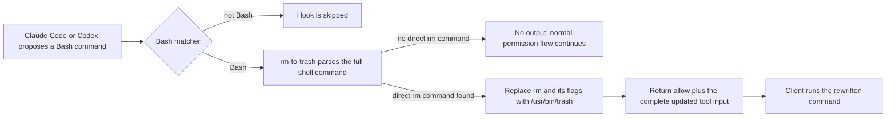

# rm-to-trash

`rm-to-trash` is a small macOS hook that changes direct `rm` commands issued by
Claude Code or Codex into `/usr/bin/trash` commands before the shell runs them.
Files remain recoverable in macOS Trash instead of being permanently deleted.

The same compiled program works with both clients because they use the same
`PreToolUse` input and `updatedInput` output shape for supported Bash calls.

## How it works



The client launches the hook for every matching Bash tool call. The program
then exits silently and quickly unless the parsed command contains a direct
`rm` invocation.

## Rewrite behavior

| Proposed command | Result |
| --- | --- |
| `rm file.txt` | `/usr/bin/trash file.txt` |
| `/bin/rm -rf build` | `/usr/bin/trash build` |
| `cd /tmp && rm -f old` | `cd /tmp && /usr/bin/trash old` |
| `rm one; /usr/bin/rm two` | `/usr/bin/trash one; /usr/bin/trash two` |
| `echo "rm file.txt"` | unchanged |
| `sudo rm file.txt` | unchanged |
| `xargs rm` | unchanged |
| `find . -exec rm {} \\;` | unchanged |
| `rm` or `rm -rf` with no path | unchanged |

The parser preserves compound commands and all unrelated tool-input fields.
It intentionally handles only direct shell command nodes. Wrapped or indirect
deletion forms are outside the current scope and must be governed separately.

## Requirements

- macOS with `/usr/bin/trash`
- Rust 1.80 or newer when building from source
- Claude Code or a Codex version with `PreToolUse` command hooks and
  `updatedInput` support

The checked-in binary is an Apple Silicon (`arm64`) macOS build. Build from
source for another architecture.

## Build and verify

Path remapping keeps local usernames and Cargo cache locations out of the
compiled executable.

```sh
RUSTFLAGS="--remap-path-prefix=$HOME=/build" cargo build --locked --release
RUSTFLAGS="--remap-path-prefix=$HOME=/build" cargo test --locked --release
RUSTFLAGS="--remap-path-prefix=$HOME=/build" cargo clippy --locked --all-targets --all-features --release -- -D warnings
cargo fmt --check
install -m 755 target/release/rm-to-trash ./rm-to-trash
cargo clean
```

The final `cargo clean` removes the large intermediate build directory. Source,
the lockfile, and the installed binary remain.

## Install for Claude Code

Use an absolute path to the executable in `~/.claude/settings.json`:

```json
{
  "hooks": {
    "PreToolUse": [
      {
        "matcher": "Bash",
        "hooks": [
          {
            "type": "command",
            "command": "/absolute/path/to/rm-to-trash",
            "timeout": 10
          }
        ]
      }
    ]
  }
}
```

Claude Code's matcher selects the `Bash` tool, not command text. The hook still
parses the entire command, including pipelines, command substitutions, and
compound statements, after it is launched.

Review the active registration with `/hooks` in Claude Code. See the official
[Claude Code hooks reference](https://code.claude.com/docs/en/hooks) for hook
locations, precedence, and output rules.

## Install for Codex

Add the handler without removing any existing events in `~/.codex/hooks.json`:

```json
{
  "hooks": {
    "PreToolUse": [
      {
        "matcher": "^Bash$",
        "hooks": [
          {
            "type": "command",
            "command": "/absolute/path/to/rm-to-trash",
            "timeout": 10,
            "statusMessage": "Redirecting rm to macOS Trash"
          }
        ]
      }
    ]
  }
}
```

`^Bash$` is an exact regular-expression match for Codex's canonical Bash hook
name. It does not inspect the shell command itself. After installation, open
`/hooks` in Codex and trust the exact hook definition. Codex stores trust
against a hash, so changing the registration requires review again.

Codex currently documents incomplete interception of shell execution paths.
This hook is a recovery aid for supported Bash calls, not a complete security
or policy boundary. See the official [Codex hooks guide](https://developers.openai.com/codex/hooks)
for current coverage and trust behavior.

## Failure behavior

- Invalid hook JSON exits with status 2 and an actionable error on stderr.
- If `/usr/bin/trash` is unavailable, a matching deletion exits with status 2
  instead of silently running the original permanent deletion.
- Unrelated events, tools, and Bash commands produce no stdout.
- The program does not write logs, read transcripts, make network requests, or
  persist command and prompt contents.

## Project layout

```text
rm-to-trash/
├── Cargo.toml       # package metadata, pinned dependencies, release profile
├── Cargo.lock       # reproducible dependency resolution
├── src/main.rs      # hook protocol, Bash parsing, rewrite logic, and tests
├── rm-to-trash      # stripped macOS arm64 release binary
└── README.md        # behavior, installation, operation, and limitations
```

## Uninstall or roll back

Remove only this handler from the relevant `PreToolUse` array, preserving other
hook events and handlers. Restart the client if it does not reload the settings
automatically. The executable can remain on disk without running when no hook
configuration references it.

