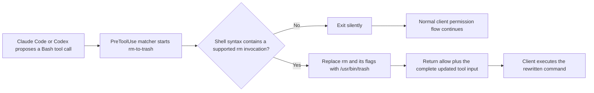

# rm-to-trash

[](https://github.com/ShlomoStept/rm-to-trash-hook/actions/workflows/ci.yml)
[](LICENSE)

`rm-to-trash` is a small macOS hook for Claude Code and Codex. It rewrites
recoverable `rm` invocations to `/usr/bin/trash` before the shell executes
them, so files go to macOS Trash instead of being permanently deleted.

It recognizes direct commands, common wrappers, dispatch through `xargs` and
`find`, compound commands, command substitutions, and literal nested shell
scripts. The rewrite is syntax-aware: text such as `echo "rm file"` is not
treated as a deletion.

> [!IMPORTANT]
> This is a recovery aid, not a security boundary. Dynamic commands and some
> specialized tool paths cannot be intercepted safely. Keep backups and normal
> permission controls enabled.

## What changes

| Proposed command | Command executed |
| --- | --- |
| `rm -rf build` | `/usr/bin/trash build` |
| `sudo rm -rf build` | `/usr/bin/trash build` |
| `env MODE=clean rm -f output` | `env MODE=clean /usr/bin/trash output` |
| `printf '%s\n' a b \| xargs rm -f` | `printf '%s\n' a b \| xargs /usr/bin/trash` |
| `find . -name '*.tmp' -exec rm -f {} +` | `find . -name '*.tmp' -exec /usr/bin/trash {} +` |
| `sh -c 'rm -rf "$1"' _ build` | `sh -c '/usr/bin/trash "$1"' _ build` |
| `cd /tmp && rm old` | `cd /tmp && /usr/bin/trash old` |
| `echo "rm old"` | unchanged |

When `sudo` directly or indirectly wraps a recognized deletion, the hook
removes `sudo`. This keeps the destination in the current user’s Trash. If the
file actually requires elevated access, the Trash command fails safely instead
of falling back to permanent deletion.

See the [rewrite contract](docs/rewrite-contract.md) for the complete supported
matrix and explicit limits.

## How it works



The matcher selects the `Bash` tool, not the text inside the command. The hook
therefore starts for every matching Bash tool call in both clients. A fast
pre-check makes unrelated calls exit without parsing or output. Running on
every Bash call is intentional: a command-only filter such as `Bash(rm *)`
would miss `sudo rm`, `xargs rm`, `find -exec rm`, and nested shell forms.

The hook preserves every unchanged field in the original tool input. When it
rewrites a command, it returns `permissionDecision: "allow"` with the complete
`updatedInput`, as required by both clients. When no rewrite applies, it emits
nothing, so the client’s normal permission flow remains in control.

## Requirements

- macOS with `/usr/bin/trash`
- Apple Silicon for the prebuilt binary
- Rust 1.85 or newer when building from source
- A Claude Code or Codex release that supports `PreToolUse` command hooks and
  `updatedInput`

Intel Mac users should build from source.

## Install

Choose the client-specific guide:

- [Claude Code installation](docs/install-claude-code.md)
- [Codex CLI and app installation](docs/install-codex.md)

Both clients can reference the same executable. Installing the file alone does
nothing; it runs only after a hook configuration points to it.

## Build from source

```sh
git clone https://github.com/ShlomoStept/rm-to-trash-hook.git
cd rm-to-trash-hook
RUSTFLAGS="--remap-path-prefix=$HOME=/build" cargo build --locked --release
install -m 755 target/release/rm-to-trash ./rm-to-trash
cargo clean
```

Path remapping keeps local usernames and Cargo cache paths out of the binary.
`cargo clean` removes the large intermediate `target` directory after the
standalone executable has been installed.

Run the complete local verification before installing a source build:

```sh
cargo fmt --check
RUSTFLAGS="--remap-path-prefix=$HOME=/build" cargo test --locked --release
RUSTFLAGS="--remap-path-prefix=$HOME=/build" cargo clippy --locked --all-targets --all-features --release -- -D warnings
cargo audit
cargo deny check
```

## Failure and privacy behavior

- Invalid hook JSON exits with status 2 and an actionable error.
- If `/usr/bin/trash` is unavailable, a recognized deletion exits with status 2
  instead of silently running the original `rm`.
- Unsupported or ambiguous commands are left unchanged. The client’s ordinary
  permissions still apply.
- The program does not write logs, read transcripts, make network requests, or
  persist command or prompt contents.
- No build directory, logs, transcripts, prompts, local configuration, or
  machine-specific paths are included in the repository or release artifact.

## Project layout

```text
.
├── .github/
│   ├── dependabot.yml
│   └── workflows/ci.yml
├── docs/
│   ├── install-claude-code.md
│   ├── install-codex.md
│   └── rewrite-contract.md
├── src/
│   ├── main.rs
│   └── rewrite.rs
├── CHANGELOG.md
├── CONTRIBUTING.md
├── Cargo.lock
├── Cargo.toml
├── deny.toml
├── LICENSE
├── README.md
├── SECURITY.md
└── rm-to-trash
```

The checked-in `rm-to-trash` file is the stripped Apple Silicon release
binary. The Rust sources remain the authority for behavior.

## Contributing and security

Behavior changes need representative positive and negative tests because a
false match can alter a shell command. See [CONTRIBUTING.md](CONTRIBUTING.md).

Please report vulnerabilities privately as described in
[SECURITY.md](SECURITY.md).

Released under the [MIT License](LICENSE).
