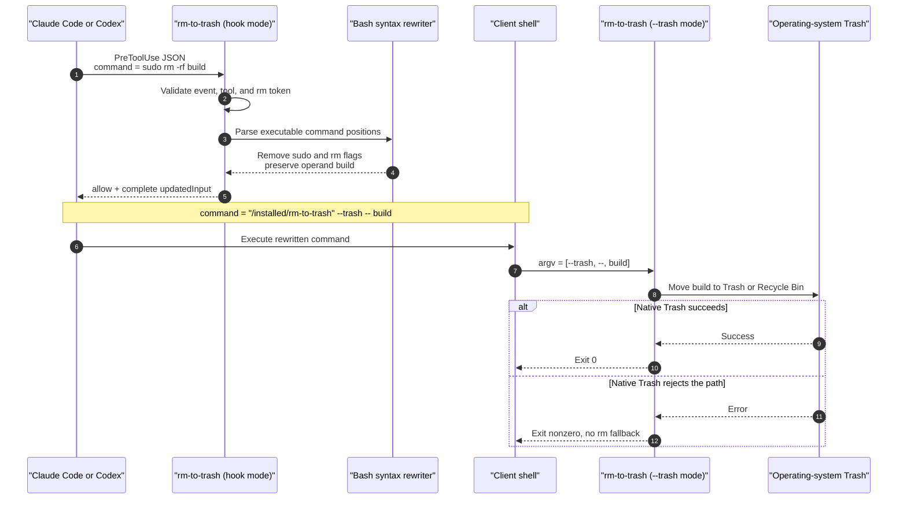
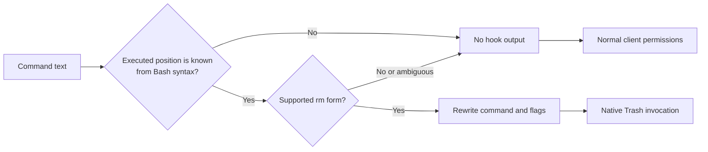

# Architecture

`rm-to-trash` has two execution modes in one native binary:

1. Hook mode reads `PreToolUse` JSON, identifies supported Bash `rm`
   invocations, and returns a complete rewritten tool input.
2. Native Trash mode receives only path operands and asks the host operating
   system to move them into its recoverable deletion area.

Keeping those responsibilities in one executable avoids depending on a
separate `trash` command whose name and availability differ by platform.

## End-to-end sequence

The second invocation is deliberate. The hook does not move files while it is
reviewing the proposed command. It first returns a visible replacement to the
client, and the client executes that replacement through its normal shell and
tool lifecycle.

## Components

| Component | Responsibility | Does not do |
| --- | --- | --- |
| `src/main.rs` | Select hook, installer, diagnostic, or native Trash mode; implement the hook JSON protocol | Parse shell syntax or edit client files directly |
| `src/rewrite.rs` | Parse Bash syntax and create non-overlapping textual replacements | Execute the shell, expand aliases, source scripts, or inspect target paths |
| `src/trash_backend.rs` | Quote the current executable safely and invoke the operating system Trash API | Fall back to permanent deletion |
| `src/install.rs` | Copy the binary and merge or remove one client handler | Replace an entire settings file or collect telemetry |
| `ci.yml` | Test the parser, installer, protocol, and native backend on macOS, Linux, and Windows | Publish releases |
| `release.yml` | Build five native assets, scan them, smoke-test them, generate checksums, and publish a tagged release | Build from an untagged or version-mismatched commit |

## Rewrite boundary

The parser acts only when it can prove that `rm` is in an executable position.
Dynamic executable names, aliases, shell functions, sourced scripts, remote
commands, and other deletion APIs are deliberately excluded.

## Safety invariants

The implementation and tests enforce these invariants:

1. No supported rewrite retains `rm`.
2. `sudo` is removed from recognized deletion paths.
3. File operands and unrelated tool-input fields are preserved.
4. The generated native command contains an explicit `--` operand boundary.
5. Unrelated or ambiguous commands produce no hook decision.
6. Parser, executable-resolution, and native Trash errors never execute the
   original permanent deletion as a fallback.
7. Installer changes are backed up, scoped to matching handlers, and
   idempotent.
8. The program does not log prompts, transcripts, or commands.

## Platform backends

The project uses the Rust
[`trash`](https://docs.rs/trash/latest/trash/) library for the native move:

- macOS uses the system Trash APIs.
- Linux implements the FreeDesktop Trash 1.0 convention.
- Windows uses the system Recycle Bin APIs.

The process is single-threaded. This matters on Linux because the library
documents synchronization concerns around mount-point discovery when unrelated
threads call the same non-thread-safe C mount functions. This binary does not
create such competing threads.

## Hook concurrency and trust

Claude Code and Codex can run multiple matching hooks. `rm-to-trash` does not
assume it runs before or after another handler. If another `PreToolUse` hook
also rewrites the `command` field, users must test that combined configuration.

Codex additionally hashes non-managed command-hook definitions. A new install,
path change, plugin update, or configuration change requires review in
`/hooks` before Codex runs the changed hook.

Neither client presents every possible execution path to local hooks. The
architecture is therefore a recovery guardrail for supported local shell calls,
not a complete host policy or deletion sandbox.
