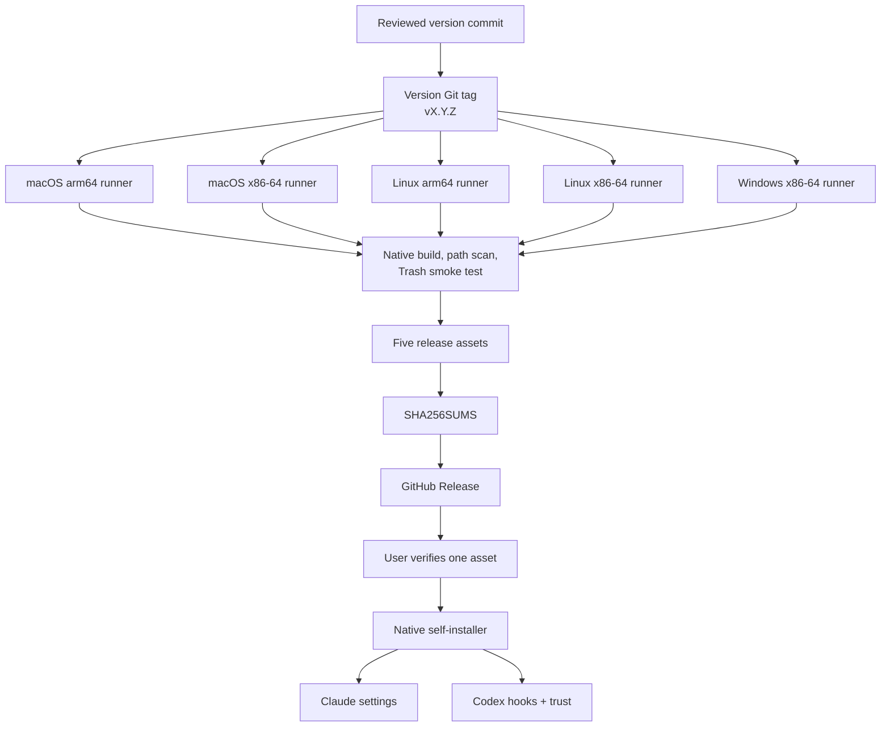

# Distribution and plugin decision

This document records how the project should be installed today and how plugin
packaging can be added without overstating what a skill or marketplace provides.

## Practical conclusion

Use the native self-installer as the primary distribution path for version
1.2. It solves the platform-selection problem, verifies one executable, merges
existing configuration safely, and supports Claude Code and Codex from the same
download.

Treat a dual-client plugin as a later convenience layer. A plugin is the right
package type for a deterministic hook, but it must first solve native-binary
selection, updates, checksum verification, Windows Git Bash coverage, and Codex
trust without downloading unverified code during a tool call.

A standalone skill is not a substitute for this hook. Skills supply contextual
instructions and workflows. They are not guaranteed to run before every shell
call, so they cannot provide the deterministic interception this project needs.

## Evaluated distribution models

### Option: Manual binary and JSON editing

Controls: Users choose a release asset, copy it, and edit one or both client
configuration files manually.

Inputs: Operating system, processor architecture, binary path, client config
path, matcher, handler, and Codex trust decision.

Benefits: Transparent and requires no installer logic.

Costs/Risks: Easy to overwrite unrelated JSON, select the wrong binary, create
duplicate handlers, or miss the Codex trust step.

Trade-offs: Maximum manual visibility, minimum installation convenience.

Choose this when: An administrator requires line-by-line manual deployment.

Avoid when: Individual users want a repeatable personal installation.

### Option: Native self-installer

Controls: One downloaded release binary copies itself and merges a handler into
Claude Code, Codex, or both.

Inputs: The selected release asset, its published checksum, and optional
`--claude`, `--codex`, or `--dry-run` flags.

Benefits: Platform selection happens before execution, configuration changes
are backed up and idempotent, unrelated settings are preserved, and no language
runtime is required.

Costs/Risks: Users still download one file manually, and Codex still requires
explicit hook trust. The installer does not alter Codex's shell sandbox, and a
restricted sandbox can deny a move into the operating system Trash. The binary
remains after uninstall so behavior is consistent on Windows.

Trade-offs: One explicit download in exchange for the smallest reliable
cross-client installation surface.

Choose this when: Installing a public release for a user account.

Avoid when: Organization policy requires managed hooks or software deployment.

### Option: Claude Code marketplace plugin

Controls: A Claude Code marketplace installs a plugin containing
`hooks/hooks.json`, metadata, and any bundled native assets.

Inputs: `.claude-plugin/marketplace.json`, `.claude-plugin/plugin.json`, hook
configuration, and a reliable platform-binary bootstrap.

Benefits: Native discovery, install, update, enable, disable, and uninstall
flows inside Claude Code.

Costs/Risks: A Git marketplace source contains the same files for every
platform. Bundling all binaries increases package size and Git history;
downloading on first hook use introduces network and integrity failure modes.

Trade-offs: Better Claude installation experience in exchange for a new binary
packaging and update surface.

Choose this when: The plugin can provide the correct verified native executable
before its `PreToolUse` hook becomes active.

Avoid when: The plugin would fetch unverified code during a deletion request.

### Option: Dual Claude Code and Codex plugin

Controls: One package carries both `.claude-plugin/plugin.json` and
`.codex-plugin/plugin.json`, plus a shared `hooks/hooks.json`.

Inputs: Both manifests, marketplace metadata, platform assets or bootstrap,
shared hook paths, Codex trust instructions, and client-specific validation.

Benefits: One conceptual package can appear in both client plugin browsers.
Current Codex plugin hooks expose `PLUGIN_ROOT` and the Claude-compatible
`CLAUDE_PLUGIN_ROOT`, which makes shared hook resources practical.

Costs/Risks: The two marketplace formats, validation commands, installation
surfaces, trust flows, and Windows command fields are not identical. Plugin
installation does not automatically trust Codex command hooks.

Trade-offs: Best eventual discovery experience, but more release machinery than
the native installer.

Choose this when: The same release process can prove the package on both
clients and all supported platforms.

Avoid when: A shared manifest is being used to conceal client-specific
differences or an untested bootstrap.

## Recommendation

Recommendation: Ship the native self-installer now, then prototype a
dual-manifest plugin as a separately tested package.

Rationale: The executable already knows its platform and can install without a
secondary runtime. Both clients support plugin-bundled hooks, but neither plugin
model removes the need to deliver the correct native binary. The self-installer
solves the present user problem with fewer moving parts.

Verification steps:

1. Download every release asset and verify `SHA256SUMS`.
2. Run `install --dry-run` against synthetic homes on macOS, Linux, and Windows.
3. Run repeated installation and confirm the second operation is a no-op.
4. Verify unrelated handlers survive install and uninstall.
5. Run `doctor`, then execute direct, wrapped, `xargs`, and `find` fixtures.
6. In Codex, review and trust the exact hook hash.
7. Before a plugin release, validate it independently with Claude Code and
   Codex, install it from its real marketplace source, and repeat the native
   behavior matrix.

## Proposed plugin package

The plugin should be added only when each file below has a tested purpose:

```text
rm-to-trash-plugin/
├── .claude-plugin/
│   └── plugin.json
├── .codex-plugin/
│   └── plugin.json
├── hooks/
│   └── hooks.json
├── scripts/
│   └── select-native-binary
├── bin/
│   ├── macos-arm64/
│   ├── macos-x86_64/
│   ├── linux-arm64/
│   ├── linux-x86_64/
│   └── windows-x86_64/
├── LICENSE
└── README.md
```

The launcher must select only a bundled, checksum-verified binary. It must not
download during `PreToolUse`. A package-registry distribution or a generated
plugin release artifact is preferable to committing changing binary blobs into
the current source tree.

For Codex plugin scaffolding, the current official documentation recommends the
built-in `@plugin-creator` skill. Use it to generate the initial manifest and
local marketplace entry, then review every generated path, capability, hook,
and trust statement manually. For Claude Code, run `claude plugin validate`
against both the plugin and marketplace before publication.

## Release data flow



## Primary documentation evidence

| Source | Relevant finding | Effect on this project |
| --- | --- | --- |
| [Claude Code hooks](https://code.claude.com/docs/en/hooks) | Plugin hooks use `hooks/hooks.json`; exec-form command hooks avoid shell quoting; Bash and PowerShell hook shells differ on Windows. | Keep a deterministic hook and validate Windows behavior explicitly. |
| [Claude Code plugin reference](https://code.claude.com/docs/en/plugins-reference) | Marketplace plugins are copied to a versioned cache and use `${CLAUDE_PLUGIN_ROOT}` for bundled files. | Never depend on paths outside the plugin root. |
| [Claude Code marketplaces](https://code.claude.com/docs/en/plugin-marketplaces) | GitHub is the recommended marketplace host and `claude plugin validate` checks marketplace and plugin structure. | Use Git hosting and validation if the plugin phase proceeds. |
| [Codex hooks](https://learn.chatgpt.com/docs/hooks) | Plugins can bundle hooks; non-managed hooks require hash-based review; `commandWindows` is available; specialized tool paths may opt out. | Preserve the trust step and avoid complete-enforcement claims. |
| [Codex plugin authoring](https://learn.chatgpt.com/docs/build-plugins) | `.codex-plugin/plugin.json` is required, plugin hooks can use shared compatibility environment variables, and `@plugin-creator` is the recommended scaffold. | A dual-manifest package is feasible but still requires client-specific review. |
| [`trash` crate](https://docs.rs/trash/latest/trash/) | The library supports macOS, Windows, and FreeDesktop-compatible Linux environments. | Use one native backend API instead of external platform-specific commands. |
| [GitHub-hosted runners](https://docs.github.com/en/actions/reference/runners/github-hosted-runners) | Public repositories have native arm64 and x86-64 runners across the required operating systems. | Build and smoke-test release assets on matching native runners. |
