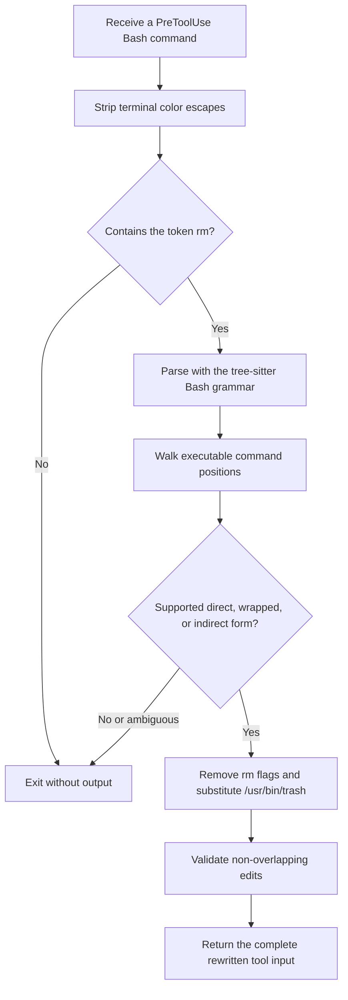

# Rewrite contract

This document defines what `rm-to-trash` version 1.1 recognizes and what it
deliberately leaves to the client’s normal permission system.

## Processing model



The program does not run shell expansion, source files, resolve aliases, or
inspect the filesystem while deciding what to rewrite. That boundary prevents
the hook from executing attacker-controlled text merely to understand it.

## Supported forms

### Direct and compound commands

These forms are recognized wherever the Bash syntax tree contains an executed
command node:

```sh
rm file
/bin/rm -rf directory
/usr/bin/rm -f one two
cd /tmp && rm old
rm one; rm two
printf '%s' "$(rm temporary)"
```

`rm` flags before the first operand are removed because macOS
`/usr/bin/trash` has a different option set. Paths, quoting, redirections,
pipelines, conditionals, and unrelated command segments remain in place.

Direct `rm` with no operand is left unchanged.

When a literal operand after `rm --` begins with `-`, the hook prefixes `./`
before passing it to `/usr/bin/trash`. Apple’s Trash utility does not support
`rm`’s `--` option terminator, so this preserves the literal filename without
turning it into a Trash option.

### Execution wrappers

The parser recognizes these wrappers when their option layout is unambiguous:

| Wrapper | Example | Rewrite rule |
| --- | --- | --- |
| `command` | `command rm -f file` | Remove `command`; use the absolute Trash path |
| `exec` | `exec rm -f file` | Keep `exec`; replace its command |
| `env` | `env MODE=clean rm -f file` | Keep environment options and assignments |
| `nice` | `nice -n 5 rm -f file` | Keep scheduling options |
| `nohup` | `nohup rm -f file` | Keep `nohup` |
| `time` | `time -p rm -f file` | Keep timing |
| `noglob` | `noglob rm -f file` | Keep the shell modifier |
| `sudo` | `sudo -u root rm -f file` | Remove `sudo` and its options |

Supported wrappers may be composed where the resulting shell command is valid,
for example `sudo env MODE=clean rm -rf build`.

`sudo` is intentionally removed rather than retained. Running
`sudo /usr/bin/trash` could put files in another user’s Trash or make recovery
unnecessarily difficult. The current user’s Trash command may fail for
protected files; it never falls back to `rm`.

Options that change a wrapper into an inspection or non-execution operation
are not rewritten. Examples include `command -v rm`, `sudo -v`, and
`sudo --list`.

### `xargs`

An explicit `rm` utility supplied to `xargs` is rewritten:

```sh
printf '%s\0' one two | xargs -0 rm -rf
# becomes
printf '%s\0' one two | xargs -0 /usr/bin/trash
```

The parser understands common macOS and GNU `xargs` options, including options
that consume the next token. For example, `xargs -I rm echo rm` is unchanged:
the first `rm` is a replacement marker and the second is data, not a command.

`xargs` with no explicit utility is unchanged because its default command is
`echo`.

An explicit supported shell with a single-quoted `-c` script is parsed too:

```sh
printf '%s\0' one two | xargs -0 sh -c 'rm -f "$1"' _
```

### `find -exec` and `find -execdir`

Direct or supported wrapped `rm` utilities, and supported single-quoted shell
scripts, between `-exec`/`-execdir` and their `\;` or `+` terminator are
rewritten:

```sh
find . -name '*.tmp' -exec rm -f {} +
find . -type d -empty -execdir sudo rm -rf {} \;
find . -type f -exec sh -c 'rm -f "$1"' _ {} \;
```

Multiple execution clauses in one `find` command are handled independently.
An execution clause with no operand is left unchanged.

### Literal nested shell scripts

The hook recursively parses a single-quoted literal command string passed to
`sh`, `bash`, `zsh`, `dash`, or `ksh` with `-c`, including combined options
such as `-lc`:

```sh
sh -c 'rm -rf "$1"' _ build
bash -lc 'cd /tmp && rm -f old'
```

A single-quoted literal passed as the only argument to `eval` is also parsed:

```sh
eval 'rm -rf build'
```

Only single-quoted literals are handled. Double-quoted or computed strings can
expand in the outer shell before the nested shell receives them, so treating
their source text as the final command would be unreliable.

## Deliberate limits

The following are unchanged:

| Form | Why it is not rewritten |
| --- | --- |
| `$command -rf path` | The executable name is computed at runtime |
| `alias rm='rm -i'; rm path` | Alias and function resolution depends on shell state |
| `bash cleanup.sh` | The deletion is in another file, not the proposed command |
| `bash -c "$script"` | The nested program is computed or expanded at runtime |
| `eval "$script"` | The evaluated program is computed at runtime |
| `ssh host rm -rf path` | The command runs on a remote system |
| `python -c 'os.remove(...)'` | It is a different deletion API |
| A hosted or specialized tool path that bypasses hooks | The client never presents the call to this program |

Unsupported does not mean approved. The hook emits no decision for these forms,
so Claude Code or Codex continues through its ordinary permission handling.

## Parse failure behavior

If the shell parser reports a total syntax failure, a conservative direct
`rm` fallback may still rewrite a recognizable deletion with an operand.
Ambiguous wrapped and indirect forms are not guessed in the fallback path.

The parser and rewrite engine cap syntax-tree and nested-script depth. Inputs
beyond those limits are left unchanged instead of risking an incomplete edit.

## Security boundary

This hook reduces accidental permanent deletion. It cannot guarantee that
every deletion API or every client execution path is intercepted. In
particular, Codex documents that specialized tool paths may opt out of the
default hook path. Treat the hook as one layer alongside backups, version
control, filesystem permissions, and client permission rules.
